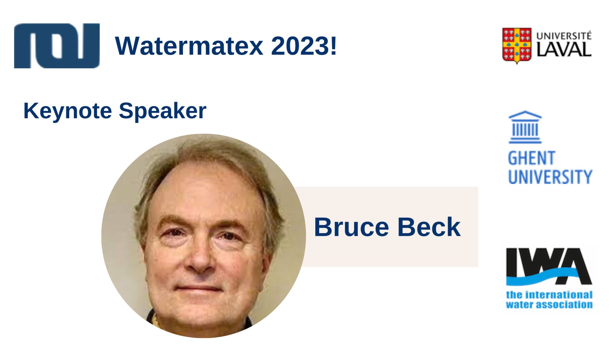

📢🌟 Breaking News! We're thrilled to announce that the eagerly awaited Watermatex 2023 program will be unveiled this week!

But wait, we have a little surprise for you in the meantime. Allow us to introduce one of our esteemed keynote speakers, M. Bruce Beck, who will be delivering a speech that will leave you inspired and ready for action.🔥

Bruce was a visionary leader and the driving force behind the establishment of the IWA MIA Specialist Group on Modelling and Integrated Assessment back in the 80s. Serving as chairman well into the 2000s, Bruce's unwavering passion and expertise have nurtured the group into one of the largest and most influential Specialist Groups within the IWA, covering all water systems.

Here's how Bruce announces his keynote address, entitled: CLIMATE CHANGE DRIVES MARKET FOR URINE-SEPARATING TOILETS":

"How could you — in 2023, in the Modelling and Integrated Assessment group (MIA) of the International Water Association (IWA) — get to such a headline? How did I, in 2010/11, get to this headline, as I was trying to populate the newly launched website of the Cities as Forces for Good Network? It was through some Systems Thinking: through its methods of Applied Systems Analysis (ASA); its style of joined-up, holistic thinking; and, perhaps most importantly, its capacities for cross-disciplinary problem-solving."

Stay tuned as we unveil the full Watermatex 2023 program, featuring a lineup of exceptional speakers, cutting-edge research, and innovative solutions for the water industry.💧🌍

